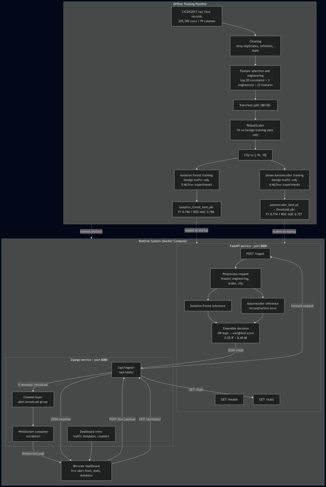

# SIMALY

A real-time network traffic anomaly detection system that combines unsupervised machine learning with a production-style serving stack. The system ingests network flow data, scores it using an ensemble of two independently trained models, and surfaces alerts through a live dashboard.

## Overview

Traditional intrusion detection relies on signature matching, which fails against attacks that have not been seen before. This system instead learns what normal network traffic looks like and flags anything that deviates from that baseline. Both models are trained exclusively on benign traffic, which mirrors how detection systems must operate in production: labeled attack data is rarely available in advance.

The system was built and validated against the CICIDS2017 dataset (Friday Working Hours, DDoS scenario), using network flow records derived from real captured traffic.

## Architecture

The system consists of two services orchestrated with Docker Compose:

- **FastAPI service** — hosts the trained models and exposes an inference API
- **Django service** — serves a real-time dashboard and pushes alerts over WebSocket



## Models

### Isolation Forest

An unsupervised ensemble model trained on benign traffic only. It isolates anomalies by measuring how easily a data point can be separated from the rest of the distribution through random partitioning. Anomalous points typically require fewer partitions to isolate.

- Trained on benign flows only
- Five experiments tracked via MLflow
- Best configuration (`if-n500`, n_estimators=500): F1 0.744, ROC-AUC 0.768

### Dense Autoencoder

A PyTorch neural network trained to reconstruct benign traffic. At inference time, the reconstruction error is used as an anomaly score: traffic patterns the model has not seen reconstruct poorly, producing a high error.

- Architecture: encoder/decoder with batch normalization and dropout
- Threshold selected via F1-optimal search over reconstruction error percentiles
- Four experiments tracked via MLflow
- Best configuration (`ae-tuned`, hidden=[256,128,64], latent=32): F1 0.774, ROC-AUC 0.727

An LSTM Autoencoder was also evaluated for sequence-based detection. It was discarded after diagnosis showed the dataset consists of independent per-flow records rather than a meaningful temporal sequence, and that unscaled reconstruction error produced an unusable threshold. This decision and the supporting evidence are documented in `training/train_lstm_autoencoder.py`.

### Ensemble Decision

A network flow is flagged as an anomaly if either model flags it independently (logical OR). The combined anomaly score is a weighted average:

```
score = 0.55 * isolation_forest_score + 0.45 * autoencoder_score
```

Severity is derived from the combined score:

| Score range   | Severity |
|---------------|----------|
| >= 0.85       | CRITICAL |
| 0.65 - 0.85   | HIGH     |
| 0.45 - 0.65   | MEDIUM   |
| < 0.45        | LOW      |

## Data Pipeline

1. Raw CICIDS2017 flow records (225,745 rows, 79 columns) are cleaned: duplicates, infinite values, and missing values are removed.
2. The 20 features most correlated with the attack label are selected, plus three engineered features (packet length ratio, backward/forward packet ratio, and backward packets per second).
3. Data is split 80/20 before any scaling is applied, to prevent leakage.
4. A `RobustScaler` is fit exclusively on benign training data, then applied to both training and test sets. This step is critical: fitting the scaler on the full dataset (including attack traffic) compresses the separation between benign and attack distributions and was found to degrade autoencoder F1 from 0.77 to below 0.20.
5. Scaled values are clipped to the range [-10, 10] to bound extreme outliers.

Final feature set: 23 columns, 223,082 rows after cleaning.

## API

The FastAPI service exposes:

- `POST /ingest` — accepts a network flow record, returns anomaly classification, severity, combined score, and per-model results
- `GET /health` — service and model status
- `GET /stats` — running totals: requests processed, anomalies detected, anomaly rate

## Dashboard

The Django service serves a dark-themed operational dashboard with:

- Live request and anomaly counters
- A traffic simulator for sending benign or DDoS-like flows on demand
- A live alert feed updated in real time via WebSocket (Django Channels)

## Tech Stack

| Layer            | Technology                          |
|-------------------|--------------------------------------|
| Model training     | scikit-learn, PyTorch                |
| Experiment tracking | MLflow (SQLite backend)             |
| Inference API      | FastAPI, Pydantic                    |
| Web dashboard      | Django, Django Channels, WebSocket   |
| Containerization   | Docker, Docker Compose               |

## Project Structure

```
siem-anomaly-detection/
├── data/
│   └── processed/              preprocessed datasets, scaler, trained model artifacts
├── notebooks/
│   └── 01_eda.ipynb            exploratory data analysis
├── training/
│   ├── rebuild_preprocessing.py
│   ├── train_isolation_forest.py
│   ├── train_autoencoder.py
│   └── train_lstm_autoencoder.py   (discarded approach, documented)
├── app/                         FastAPI service
│   ├── main.py
│   ├── model.py
│   ├── ensemble.py
│   └── schemas.py
├── dashboard/                   Django app
│   ├── views.py
│   ├── consumers.py
│   ├── routing.py
│   └── templates/dashboard/
├── web/                         Django project config
├── Dockerfile.fastapi
├── Dockerfile.django
├── docker-compose.yml
└── requirements.txt
```

## Running the System

### Local development

Two services need to run simultaneously:

```
uvicorn app.main:app --port 8000 --reload
daphne -p 8080 web.asgi:application
```

### Docker Compose

```
docker compose up --build
```

This builds and starts both services. The FastAPI service includes a health check; the Django service waits for it to report healthy before starting.

The dashboard is available at `http://localhost:8080`. The inference API is available at `http://localhost:8000`.

## Reproducing the Models

```
python training/rebuild_preprocessing.py
python training/train_isolation_forest.py
python training/train_autoencoder.py
```

Experiment results can be inspected with:

```
mlflow ui --backend-store-uri sqlite:///mlflow.db
```

## Notes on Scope

This project is a portfolio implementation intended to demonstrate an end-to-end ML system: data preprocessing, model experimentation with tracked results, an ensemble inference service, and a real-time monitoring interface. It is not connected to a live network capture and does not deploy to a hosted environment.
